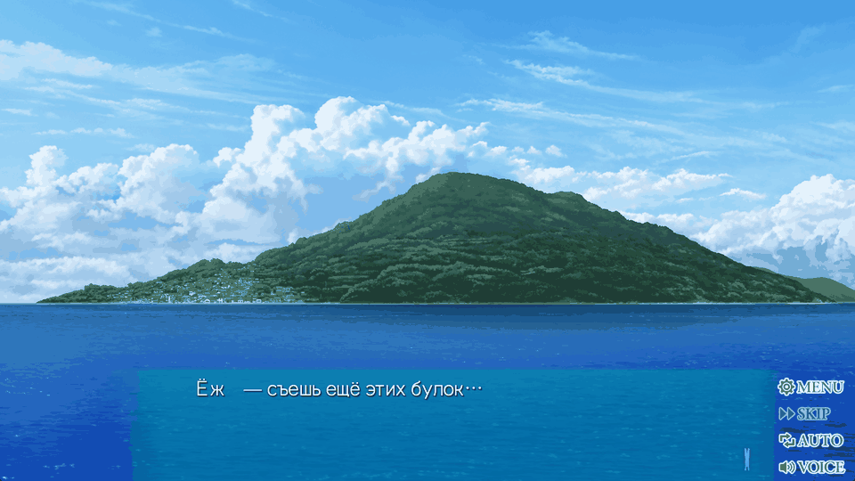

# Проверка Steam/LUCA

Дата: 2026-07-30.

Установка: `Summer Pockets REFLECTION BLUE_Steam`.

## Исходник и резервная копия

Перед первой модификацией `files/SCRIPT.PAK` скопирован в
`files/SCRIPT.PAK.orig`. Оба файла на момент копирования имели:

```text
size   15728780
sha256 A3878B0BB7777B3ABC7DED44A80614986385E5418EEA24D024AC06F41074E99B
```

Все последующие сборки начинаются только с `.orig`.

## Нулевой round-trip

Результат: `build/steam/SCRIPT.roundtrip.PAK`.

```powershell
python -c "import sys;sys.path.insert(0,'game-tools');from luca import Pak;p=Pak(r'Summer Pockets REFLECTION BLUE_Steam/files/SCRIPT.PAK.orig');p.build(r'build/steam/SCRIPT.roundtrip.PAK')"
```

```text
source size   15728780
output size   15728780
source sha256 A3878B0BB7777B3ABC7DED44A80614986385E5418EEA24D024AC06F41074E99B
output sha256 A3878B0BB7777B3ABC7DED44A80614986385E5418EEA24D024AC06F41074E99B
byte identical true
```

## Полный разбор сценария

Команда:

```powershell
python game-tools/probes/scan_luca_scripts.py "Summer Pockets REFLECTION BLUE_Steam/files/SCRIPT.PAK.orig"
```

Результат:

```text
PAK entries                     427
script entries parsed           417/417
records                         287663
scripts ending in opcode 25     417/417
multilingual text groups        96806
opcode 36 text groups           96621
opcode 40 text groups           185
opcode 36 non-text variants     155
coverage                        all three slots nonempty in 96806/96806
```

Языковые слоты:

| Слот | Язык | Символов | Кана | Ханьцзы | Латиница | Маркеры упрощённого | `U+FF0C` |
|---:|---|---:|---:|---:|---:|---:|---:|
| 0 | японский | 1 781 680 | 943 522 | 384 660 | 4 043 | 0 | 0 |
| 1 | английский | 3 964 856 | 8 806 | 3 280 | 2 877 608 | 0 | 0 |
| 2 | упрощённый китайский | 1 539 143 | 8 889 | 1 047 640 | 6 185 | 52 742 | 32 851 |

## Локальный каталог источников

Команда:

```powershell
python game-tools/export_luca_sources.py
```

Результат не выводит сюжетный текст:

```text
source set                  SPRB_STEAM_LUCA
records                     287663
candidate records           96961
translatable                96806
service/non-text            155
structural, not exported    190702
catalog sha256              73B6787065B5E5BB907BD0B2F5158596D284726F45BA28B72413F72B38241C63
speaker marker in any slot  69383
speaker marker in all slots 69342
partial slot markers        41
```

Полный `source/parsed/steam-luca/source-records.jsonl` игнорируется Git.
`source/manifest.jsonl` фиксирует исходный PAK, языковые слоты, точные количества
и хэш каталога. Повторный экспорт той же ревизии даёт тот же JSONL и хэш.

Ведущий фрагмент `@speaker@` разобран отдельно от тела реплики в каждом слоте.
Это не универсальный непрозрачный тег: имя может различаться по языкам, а в 41
группе маркер есть только в английском и китайском слотах. Сырой текст и его
хэш сохраняются, но в переводческий контекст гидратируется тело реплики и
отдельно нормализованный говорящий.

## Ссылки и релокация

Независимая проверка исходника:

```text
script entries       417
records              287663
explicit opcode refs 9462
_scr_label refs      1474
unresolved refs      0
```

Стресс-команда:

```powershell
python game-tools/probes/validate_luca_relocation.py
```

Она увеличивает английский слот во всех декодируемых командах opcode 36/40 и
не выводит текст сценария.

```text
text records changed 96806
archive size         15728780 -> 15827068
script entries       417
records              287663
explicit opcode refs 9462
_scr_label refs      1474
failures             0
output sha256        D9840223379DAD6922A3141AC715FFCB96D3C62FBD7B4844C8C25D2BC9F332A3
```

## Русская строка произвольной длины

Сборка:

```powershell
python game-tools/build_luca_test.py --save-test relocation --output build/steam/SCRIPT.russian-relocation-test.PAK
```

Результат:

```text
archive size            15728808
save-point UTF-8 bytes  52 -> 108
records                 287663
explicit opcode refs    9462
_scr_label refs         1474
output sha256           7FB4E4A4D8AB45EC7144BB8A517113DB2831C53A970EE72E029A34843C884B81
```

После установки тестового PAK автоматическая загрузка существующего сейва
успешно открыла сцену. Полная строка видна без разрежения и обрезания:


Команды запуска и штатного выхода:

```powershell
powershell -File game-tools/game_steam.ps1 -Action resume -Out docs/project/evidence/steam-luca-relocation.png
powershell -File game-tools/game_steam.ps1 -Action exit
```

`exit` открыл MENU, выбрал EXIT, подтвердил выход и проверил исчезновение
процесса. Windows-сессия для этой автоматизации должна оставаться
разблокированной.

## Кириллица и пунктуация

Штатный текстурный шрифт отображает прямой UTF-8 без carrier encoding.

Обычная строка:


Редкие буквы:


Пунктуация:



На последнем кадре `Ё/ё`, `ъ`, `ь`, `щ`, `э`, `—` и `…` отображаются.
Исходные `«»` отсутствуют на экране. Зонд `scan_luca_fonts.py` объясняет это
однозначно: `U+00AB/U+00BB` имеют индекс глифа 0 во всех 46 INFO-таблицах, тогда
как `U+2014`, `U+2026`, `U+275D/U+275E` присутствуют во всех 17 регулярных
таблицах `FONT__INFO.PAK`; `info40` покрывает 66/66 русских букв.

## Стартовые интертитры

Канонический источник: `translation/ui/opening-titles.json`. Он содержит 17
русских строк и одобренный render profile для английских image entries
`EF_CHARACTER01_00en`..`EF_CHARACTER01_16en`.

```powershell
python game-tools/build_luca_opening_images.py
powershell -File game-tools/game_steam.ps1 -Action opening -Out build/steam/opening-preview-shot -Frames 80 -Interval 1200
powershell -File game-tools/game_steam.ps1 -Action exit
```

```text
pristine OTHCG.PAK entries       2127
pristine OTHCG.PAK sha256        9F6BB18EE3E33AE51FC1DD9B0E89A8CDB5D702684690BAF6ECDBBF1D24B24F6F
source image codec               CZ3
replaced entries                 17
replacement codec               CZ0 RGBA
replacement size                8294464 bytes each
output OTHCG.PAK sha256          86E42DC14DD7E3272EBDB2845537A62BA227CA8A0A4411EE5A4A1300FDF435C0
independent payload read-back    17/17
independent pixel read-back      17/17
captured opening cards           17/17
```

Новый экземпляр `Pak` подтвердил неизменность 2127 ID, имён и порядка записей,
побайтовое совпадение 17 payload и повторное декодирование pixels. 80 кадров с
интервалом 1200 мс покрыли весь fade-цикл: после последней карточки игра перешла
в сцену. Пользователь просмотрел установленный вариант и утвердил его
2026-08-18 (`DEC-0038`, `FND-0084`).

## Текущее установленное состояние

После теста архив игры восстановлен не в pristine-состояние, а в безопасную
двухстрочную диагностическую сборку `natural`, заново построенную из `.orig`:

```text
active files/SCRIPT.PAK size   15728780
active files/SCRIPT.PAK sha256 ABAAB02C4442EDCBDBA8D2276C188779AC2C4A8DDABD526BEF804BF8EE47FF44
```

Игра закрыта. Нетронутый источник остаётся в `files/SCRIPT.PAK.orig`.

## Статический предел языков

Проверенный `SummerPocketsRB.exe` имеет SHA-256
`CDDEBE8E27ACDB0F57679BA46B2224C599F9BC149A2AC8E54E3DA36A9D8A94CA`.
Трёхъязычность закреплена не только ресурсами:

| Область | RVA/факт |
|---|---|
| переключение языка | `0x0DEFE0`, проверки границы 3 у `0x0DF25F` и `0x0DF288` |
| Steam -> game language | `0x0CE860`, значения 0/1/2 |
| таблица суффиксов | `0x7FE4C0`: base, `_en`, `_zc` |
| языковое меню | `0x3621D0`, создаёт три пункта |
| стартовые подписи | около `0x0CBC19`, передаётся count 3 |
| трёхэлементный цикл | `0x065E8D`, три блока с шагом `0x2668` |
| global текущего языка | `0x7EF9B0`, 597 ссылок в 171 функции |

Обнаружено не менее 62 прямых сравнений с 3 в 16 функциях. Поэтому native
значение языка 3 требует отдельного проекта по патчу EXE; оно не добавляется
расширением одной сценарной записи.
